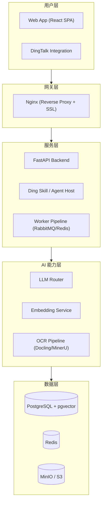

# FileX · 面向智能体的企业知识底座

> **AI Knowledge Base for Agents** — Turn scattered documents into searchable, traceable, Agent-readable knowledge assets.
>
> **AI 智能体资料库** — 让团队文件变成可检索、可追踪、可被智能体调用的结构化知识资产。

[**中文版**](README.md) · [English](README.en.md)

---

## 目录

- [产品概述](#产品概述)
- [产品亮点](#产品亮点)
- [核心功能](#核心功能)
  - [登录](#login)
  - [知识库总览](#kb-overview)
  - [知识库管理](#kb-management)
    - [原始资料列表](#file-list)
    - [原件预览](#file-preview)
    - [智能体笔记](#agent-note)
    - [OKF 互操作](#okf)
    - [流程追踪](#process-trace)
    - [多样处理与重新索引](#multi-process)
    - [RAPTOR 后处理](#raptor)
    - [知识库多维度分析](#kb-analysis)
      - [查看知识库整体概况](#kb-metrics)
      - [文档关联图谱](#wiki-graph)
      - [标签热点分析](#tag-heatmap)
  - [处理过程可视化](#process-viz)
  - [智能体调用追踪](#agent-trace)
  - [系统配置中心](#settings)
  - [在线帮助文档](#help-docs)
- [技术栈](#技术栈)
  - [前端](#前端)
  - [后端](#后端)
  - [基础设施](#基础设施)
- [架构概览](#架构概览)
- [获取与部署](#获取与部署)
- [项目状态](#项目状态)
- [许可证](#许可证)

## 产品概述 [↑](#目录)

FileX 是一个面向团队和个人的 AI 增强型知识管理平台。它把文档管理、正文提取、语义检索、知识图谱与智能体工具调用整合在一起，帮助组织从分散文件中构建可复用的知识资产。

**产品形态**：FileX 提供资料库网站；钉 / Ding 是面向智能体的技能与入口。

**演示体验**：[ding.yyyou.top](https://ding.yyyou.top) — 仅供体验，请勿上传隐私数据。数据库可能随时清理，请注意备份。

**联系作者**：微信 `roamerxv` · 邮箱 [roamerxv@163.com](mailto:roamerxv@163.com)

**国际化 i18n**：内置国际化支持（i18next），默认中英双语，可扩展至更多语言。

---

## 产品亮点 [↑](#目录)

- **多引擎文档流水线** — [Docling](https://github.com/IBM/docling)（IBM）、[MinerU](https://github.com/opendatalab/MinerU)（OpenDataLab）、Insavlo 多套解析引擎按文档类型自动路由，覆盖 Office、PDF、图片等格式。流水线全程可视化，每个环节的状态与耗时均可回溯。
- **RAPTOR 分层检索** — 引入斯坦福大学 [RAPTOR 算法](https://arxiv.org/abs/2401.18059)对已索引文档做递归抽象与分层摘要，构建树形语义结构，大幅提升长文档与多文档场景下的检索精度。
- **文档关联图谱** — 以 [Andrej Karpathy 资料库](https://github.com/karpathy)为例，自动构建文档间的引用与标签关系网络，可视化知识单元的拓扑连接，辅助发现隐式关联与知识孤岛。
- **智能体可编辑笔记** — OCR 与解析结果自动生成结构化的 Markdown 笔记，供智能体直接阅读。用户可随时修改、补充内容，将机器提取结果转化为团队知识沉淀。
- **跨平台一键部署** — Docker Compose 单服务器即可拉起全部依赖（PostgreSQL、RabbitMQ、Redis、Ollama 等），macOS / Linux / Windows 全平台支持。
- **热插拔配置** — LLM 模型路由、嵌入引擎、解析策略等系统参数集中管理，配置变更即时生效，无需重启服务。

---

## 核心功能 [↑](#目录)

**登录** [↑](#目录)

支持账号密码登录与企业认证，提供安全的用户鉴权与工作空间切换入口。

  

**知识库总览** [↑](#目录)

资料库的总体视图，支持自定义维护的目录结构与分类管理。

  

**知识库管理** [↑](#目录)

- 显示用户所有的上传的原始资料列表 [↑](#目录)

  

- 预览资料的原始内容 [↑](#目录)

  

- 智能体笔记：文档经过 OCR 或解析处理后生成的 Markdown 笔记，供智能体阅读使用。用户可随时修改、补充内容，类似在线笔记。 [↑](#目录)

  

- OKF 互操作：支持 Google OKF（Open Knowledge Format）规范的导入、导出与校验，实现跨平台知识资产交换。 [↑](#目录)

  

- 流程追踪：文档从上传、OCR 解析、向量索引到检索匹配的完整流水线，每个环节的状态均可实时查看与回溯。 [↑](#目录)

  

- 多样处理与重新索引：支持 Docling、MinerU、Insavlo 等多套解析引擎，可根据文档类型灵活路由；分块策略可调，支持对指定文件重新提取与索引。 [↑](#目录)

  

  

- RAPTOR 后处理：采用斯坦福 RAPTOR 算法对已索引文档进行递归抽象与分层摘要，构建树形语义结构，提升长文档与多文档场景下的检索精度与知识库质量。 [↑](#目录)

  

- 知识库多维度分析 [↑](#目录)
    - 查看知识库整体概况：从文件列表、索引状态、检索质量等多角度审视知识库，辅助评估与优化知识资产结构。 [↑](#目录)

  

    - 文档关联图谱：以 Andrej Karpathy 资料库为例，自动构建文档间的引用与标签关系网络，可视化知识单元的拓扑连接，辅助发现隐式关联与知识孤岛。 [↑](#目录)

  

    - 标签热点分析：基于文档标签的使用频率与关联强度生成标签云与热点图，直观呈现知识库的主题分布，辅助快速定位高频话题与内容盲区。 [↑](#目录)

  

**处理过程可视化** [↑](#目录)

文档处理流水线的全程可视化看板，实时展示上传、提取、索引、检索等各环节的状态与耗时。支持对异常任务进行手动重试、死信队列排空与索引重建，帮助运维人员快速定位瓶颈与修复故障。

  

**智能体调用追踪** [↑](#目录)

智能体请求的完整调用链路追踪，记录每次 Agent 推理的输入、中间思考、工具调用及最终输出。支持按会话回溯执行过程，便于调试与效果评估。

  

  

**系统配置中心** [↑](#目录)

所有系统参数集中管理，涵盖 LLM 模型路由、嵌入引擎、解析策略、缓存规则等模块。配置变更即时生效，无需重启服务或重新部署，支持热插拔式切换后端服务（Ollama / OpenAI / Azure 等）。

  

**在线帮助文档** [↑](#目录)

内置完善的帮助系统，覆盖从入门到高级运维的全部操作指引，包括资料管理、检索调优、Agent 技能开发、系统配置等主题。支持全文搜索与版本对照，用户可随时查阅，降低学习与运维门槛。

  

---

## 技术栈 [↑](#目录)

### 前端 [↑](#目录)

| 类别 | 技术 |
|---|---|
| 框架 | React 19 + TypeScript |
| 构建 | Vite |
| 组件库 | Ant Design 5 |
| 状态管理 | Zustand |
| 路由 | React Router 6 |
| 国际化 | i18next |
| 文档预览 | docx-preview, pptx-preview, xlsx, KaTeX |
| 图表 | ECharts |
| HTTP | Axios |

### 后端 [↑](#目录)

| 类别 | 技术 |
|---|---|
| 运行时 | Python 3.13 |
| 框架 | FastAPI |
| 数据库 | PostgreSQL 16 + pgvector |
| AI/ML | Ollama / OpenAI / Azure 兼容模型，Embedding 模型 |
| OCR | Docling, MinerU |
| Agent | 钉技能；LangGraph 可在外部 Agent 宿主侧编排 |
| 异步任务 | RabbitMQ + Redis，多 worker 流水线 |
| 搜索 | 全文检索 + 向量检索 + 重排序 |

### 基础设施 [↑](#目录)

- Docker Compose 部署
- MinIO / S3 对象存储
- Nginx 反向代理 + SSL

---

## 架构概览 [↑](#目录)

详细架构说明见 [docs/architecture.md](docs/architecture.md)。

---

## 获取与部署 [↑](#目录)

FileX 当前为专有软件，GitHub 仓库仅用于产品展示，不包含可运行源码。生产版本基于 Docker Compose 部署，支持单服务器运行完整知识管理服务，含 PostgreSQL、RabbitMQ、Redis、Ollama 等依赖；GPU 服务器可用于 OCR 与嵌入推理加速。

  

需要演示、试用或私有化部署，请通过上方联系方式沟通。公开演示站仅供体验，请勿上传隐私数据。

---

## 项目状态 [↑](#目录)

FileX 处于活跃开发阶段，功能持续迭代。

---

## 许可证 [↑](#目录)

本项目为专有软件，保留所有权利。
