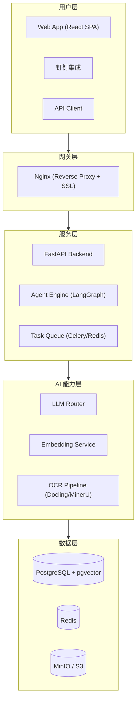
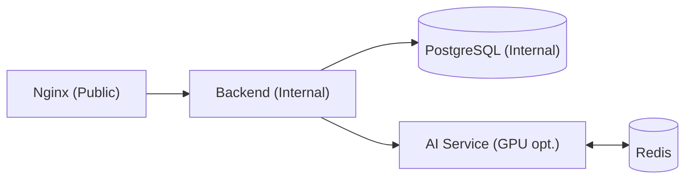

# FileX 架构概览

本文档提供 FileX 平台的高层架构说明，不含实现细节。

---

## 系统分层

---

## 关键设计决策

### 前端 SPA

- 单页应用架构，通过 API Gateway 与后端通信
- Ant Design 5 提供企业级 UI 组件
- Zustand 管理客户端状态，减少不必要的服务端请求
- 内置多文档格式预览能力（Office、PDF、Markdown、LaTeX）

### 后端微服务风格

- FastAPI 提供 REST 和 WebSocket 接口
- 任务队列（Celery + Redis）处理异步工作：文档解析、向量索引、批量提取
- 模块化设计：知识库、索引、提取、Agent、Wiki 各自独立

### AI 能力层

- 多种 LLM 后端支持（OpenAI、Azure OpenAI、Ollama 本地模型）
- Embedding 服务统一管理向量化流程
- OCR 管道支持 Docling 和 MinerU 两种引擎，根据文档类型自动路由
- Agent 引擎基于 LangGraph 构建工作流

### 数据存储

- PostgreSQL + pgvector 扩展支持结构化数据与向量检索
- MinIO / S3 存储原始文件与预处理中间结果
- Redis 缓存与任务队列

---

## 部署拓扑

支持单机 Docker Compose 部署与分布式部署两种模式。

支持单机 Docker Compose 部署与分布式部署两种模式。

---

## 安全说明

- 所有 API 通过 API Key 或 OAuth 认证
- 文件访问受工作空间级 ACL 控制
- HTTPS 传输加密
- LLM 请求支持自定义端点，数据不出域
